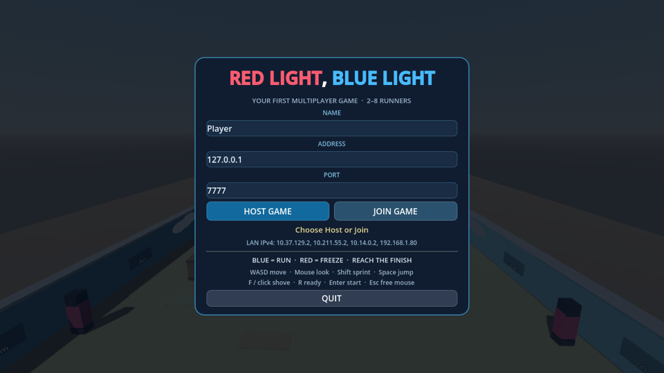
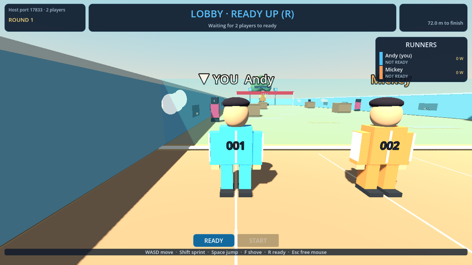
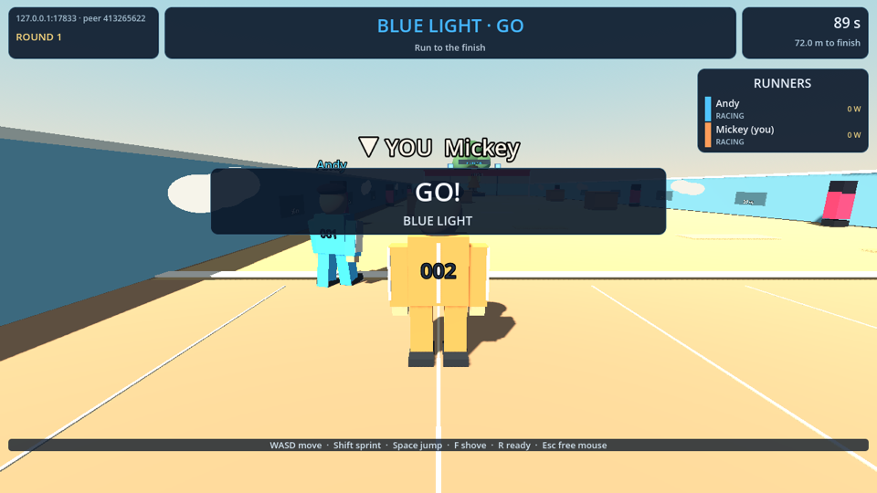
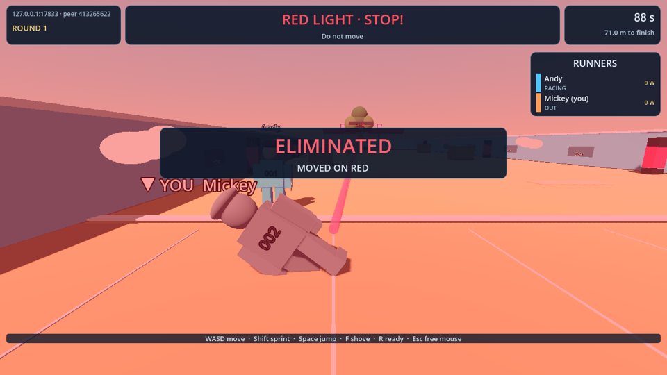

# Red Light, Blue Light

A Godot 4.8 multiplayer 3D race for 2–8 runners. The host plays as peer 1. Cross the field on **BLUE**, heed the amber warning, and stand still on **RED** while the server watches for movement. The level, characters, interface, and audio are built in GDScript from Godot primitives; the project uses no external art or sound assets.

## Screenshots

Captured from two networked peers by `tests/screenshots.gd` (host view and client view).

| Menu | Two-player lobby (host) |
| --- | --- |
|  |  |
| **Blue light (client)** | **Red light elimination (client)** |
|  |  |

To re-capture (needs a window, not `--headless`):

```sh
RLBL_SHOT_DIR=/tmp/shots /Applications/Godot.app/Contents/MacOS/Godot --path . -s res://tests/screenshots.gd
```

## Start two instances

Open [project.godot](project.godot) in Godot 4.8 and press F5. In the editor, choose **Debug → Customize Run Instances → 2 instances**, then run the project. Host in one window and join `127.0.0.1` in the other. A single ready host can also start a test round.

Or, from this directory, open two terminals:

```sh
/Applications/Godot.app/Contents/MacOS/Godot --path . -- --host --name=Andy
/Applications/Godot.app/Contents/MacOS/Godot --path . -- --join=127.0.0.1 --name=Mickey
```

For two computers on the same LAN, host on one, read its IPv4 address from the menu, and enter that address on the second computer. Both must use the same port (default **7777 UDP**); allow incoming Godot/UDP traffic through the host firewall. The CLI accepts `--port=7777` on both sides. Up to seven clients can join. Someone arriving mid-round is marked spectating and joins the next round.

## Controls

| Input | Action |
| --- | --- |
| WASD / arrow keys | Move |
| Mouse | Look around with the local player's third-person camera |
| Shift | Sprint |
| Space | Jump |
| F / left click | Shove the nearest runner within reach |
| R / READY | Toggle ready in the lobby |
| Enter / START | Host starts once all players are ready |
| Esc | Free the mouse for UI; click the game to capture it again |
| LEAVE | Disconnect and return to the menu |

## Rules

Ready up, then the host starts a three-second countdown. The start gate opens for a 90-second race. Blue lasts 2–5 seconds, amber warns for 0.45–0.8 seconds, and red lasts 2–4 seconds. On red, the server allows 0.3 seconds before recording each active runner's synced position. Moving more than 0.4 m horizontally from that point eliminates the runner; jumping in place is safe. A shove is range checked and has a 1.2-second cooldown; a shove on red eliminates its target. Crossing the finish records place and elapsed time. Remaining runners are out at timeout. When no active runners remain, results appear for eight seconds; the first finisher gains one win. Everyone returns to the lobby for another round.

## Assignment checklist

| Brief section | Concrete implementation |
| --- | --- |
| §5.1 3D environment | Ground, walls, obstacles, spawn slots, lighting, gate, guards and doll in [`level.gd`](scripts/level.gd) and [`doll.gd`](scripts/doll.gd) |
| §5.2 Session | Host/Join menu, ENet server and client, connection lifecycle in [`menu.gd`](scripts/ui/menu.gd) and [`main.gd`](scripts/main.gd) |
| §5.3 Spawning | Server-only `MultiplayerSpawner`, unique peer-ID node names and eight slots in [`main.gd`](scripts/main.gd) |
| §5.4 Movement sync | Position, model yaw and speed in [`player.tscn`](scenes/player.tscn); owner writes and remote copies interpolate in [`player.gd`](scripts/player.gd) |
| §5.5 Local vs remote | `is_multiplayer_authority()` gates input and movement in [`player.gd`](scripts/player.gd) |
| §5.6 Camera | Only the locally owned player creates a camera in [`player.gd`](scripts/player.gd) |
| §6 Gameplay feature | Server judges red-light movement, finishes, ranking, timer and shoves in [`match_controller.gd`](scripts/match_controller.gd) |
| §7 Shared state | Roster, phase, light, results and clock RPCs in [`match_controller.gd`](scripts/match_controller.gd) |
| §8 UI | Host/Join menu plus HUD banner, timer, roster, results and controls in [`menu.gd`](scripts/ui/menu.gd) and [`hud.gd`](scripts/ui/hud.gd) |
| §9 Testing | Real ENet host/client in isolated SubViewports in [`smoke_test.gd`](tests/smoke_test.gd) |
| §10 Extensions | Ready system, timed rounds, race ranking, shove mechanic, late-join spectating, procedural presentation; see below |
| §17 Bonus | Lobby, names above runners, respawn, match phases and LAN play in [`main.gd`](scripts/main.gd), [`match_controller.gd`](scripts/match_controller.gd), [`player.gd`](scripts/player.gd) |

### Extensions beyond the tutorial

| Extension | Type | Where |
| --- | --- | --- |
| Ready lobby and host-only start | Programming | `match_controller.gd`, `hud.gd` |
| Server-owned blue/amber/red cycle with reaction grace | Programming | `match_controller.gd` |
| Timed race, finish order and winner wins | Programming | `match_controller.gd` |
| Shove with server range/cooldown checks and owner impulse | Programming | `match_controller.gd`, `player.gd` |
| Late-join spectating and state snapshot | Programming | `main.gd`, `match_controller.gd` |
| Automatic respawn and repeat rounds | Programming | `match_controller.gd`, `player.gd` |
| Sprint and jump | Programming | `player.gd` |
| Distinct runner colours, bibs and name tags | Visual | `player.gd` |
| Procedural doll, lamps, guards, obstacles and laser | Visual | `level.gd`, `doll.gd` |
| Synthesized sound cues | Audio | `sound_fx.gd` |

## Test

From the project directory:

```sh
RLBL_TEST_PORT=17815 /Applications/Godot.app/Contents/MacOS/Godot --headless --path . -s res://tests/smoke_test.gd
```

The test launches independent host and client multiplayer instances inside SubViewports, adds a third peer during play, and checks connection, spawning, ownership, movement, round state, shoves, disconnection and rehosting. It prints a final PASS/FAIL line. See [technical report](documentation/TECHNICAL_REPORT.md), [architecture](documentation/ARCHITECTURE.md), and [demo guide](documentation/DEMO_GUIDE.md).

## Acknowledgements

Built with AI assistance: Claude Code orchestrated and reviewed the work; OpenAI Codex implemented it. Godot reference: [Your First Multiplayer Game tutorial](https://www.youtube.com/watch?v=n8D3vEx7NAE). No external assets were used.
