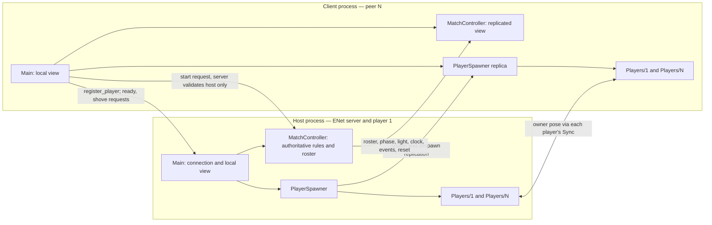

# Multiplayer architecture



The player owner may be the host or a client. The `Sync` on every copy has the same authority ID; that authority sends position, model yaw and speed to its replicas. The arrows between player sets represent both owner directions, not two authorities for one player.

```text
Host process (peer 1, ENet server)             Client process (peer N)
Main                                          Main
├─ Match [server rules + roster] --RPCs----> ├─ Match [shared view]
├─ PlayerSpawner --spawns/despawns----------> ├─ PlayerSpawner replica
└─ Players                                    └─ Players
   ├─ 1 [host owns root + Sync] --pose------>    ├─ 1 [remote copy]
   └─ N [remote copy] <---------pose----------   └─ N [client owns root + Sync]
Client --register/ready/shove requests------> Host/Match
Host Match --reset/finish/out/shove event----> Client Match
```

## Six questions from brief §12

| Question | Answer |
| --- | --- |
| Who is server/host? | The instance that chooses Host creates an `ENetMultiplayerPeer` server and plays as peer 1 (`scripts/main.gd`). |
| Who is client? | Every Join instance is an ENet client, normally peers 2–8. |
| Who creates player objects? | The server alone calls `MultiplayerSpawner.spawn()`; the spawner creates corresponding copies on clients. |
| Who owns each player? | The peer whose ID names that player node owns its `RacePlayer` and `Sync` child (`scripts/player.gd`). |
| What is synchronised? | Runner position, model yaw and speed; server roster, ready/status, finish place/time/wins, phase, light, clock corrections and gameplay events. |
| What stays local? | Raw input, camera and mouse state, movement simulation on the owner, remote interpolation, limb animation, HUD layout and audio playback. |

## RPC reference

`call_local` means the sender executes its own RPC body too. Request handlers still reject calls on non-server instances. All names below are declared in `scripts/main.gd` or `scripts/match_controller.gd`.

| RPC | Direction | Delivery | Purpose |
| --- | --- | --- | --- |
| `register_player(name)` | Client → server | Reliable, remote | Supply name after connection; server allocates slot and spawns. |
| `request_player_ready(ready)` | Player → server | Reliable, local | Set sender's ready flag in lobby. |
| `request_start()` | Host → server | Reliable, local | Start only if sender is peer 1 and everyone is ready. |
| `request_shove(target_id)` | Player → server | Reliable, local | Validate target, phase, reach and cooldown. |
| `_receive_shove(impulse)` | Server → target owner | Reliable, local | Apply impulse on the target's owner. |
| `_sync_roster(roster)` | Server → all / late joiner | Reliable, local | Replace roster snapshot and update UI. |
| `_sync_phase(phase, time, round)` | Server → all / late joiner | Reliable, local | Enter lobby, countdown, play or results. |
| `_sync_light(light)` | Server → all / late joiner | Reliable, local | Set blue, amber or red on every peer. |
| `_sync_clock(time)` | Server → clients | Unreliable, local | Correct client clock about once a second. |
| `_announce_elimination(id, reason)` | Server → all | Reliable, local | Mark/announce elimination and play effects. |
| `_announce_finish(id, place, time)` | Server → all | Reliable, local | Announce placement and finish sound. |
| `_announce_shove(attacker, target)` | Server → all | Reliable, local | Show shove animation and sound. |
| `_reset_positions()` | Server → all owners | Reliable, local | Each owner teleports its own player to spawn. |

The `MultiplayerSpawner` and `MultiplayerSynchronizer` also replicate spawns and continuous pose through Godot's built-in networking; they are not custom RPC methods. `sync_to_peer(id)` sends the current roster, phase/time and light with targeted RPCs after a late join.

## Join to elimination

```mermaid
sequenceDiagram
    participant C as Joining client
    participant S as Host Main / Spawner
    participant M as Host MatchController
    participant P as All peer copies
    C->>S: ENet connect; register_player(name)
    S->>M: add_player(id, name, free slot)
    S->>P: MultiplayerSpawner.spawn(id, name, slot)
    S->>C: sync_to_peer(roster, phase/time, light)
    Note over C,M: Mid-round joiner is SPECTATING until next round
    C->>M: request_player_ready(true) in lobby
    M->>P: _sync_roster(ready state)
    S->>M: request_start() after all ready
    M->>P: _reset_positions; countdown phase
    M->>P: playing phase; blue/amber/red light RPCs
    P-->>M: Owner Sync sends position/yaw/speed
    M->>M: After red grace, compare with position snapshot
    M->>P: _sync_roster(OUT); _announce_elimination(id, reason)
```

See the [technical report](TECHNICAL_REPORT.md) for timing, trust boundaries and trade-offs.
